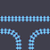

# Wave Function Collapse

This is a simple implementation of the wave function collapse algoritm using tiles and backracking.

# Sample Output

## Circuit

### Input

### Output

## Tracks

### Input

### Output

